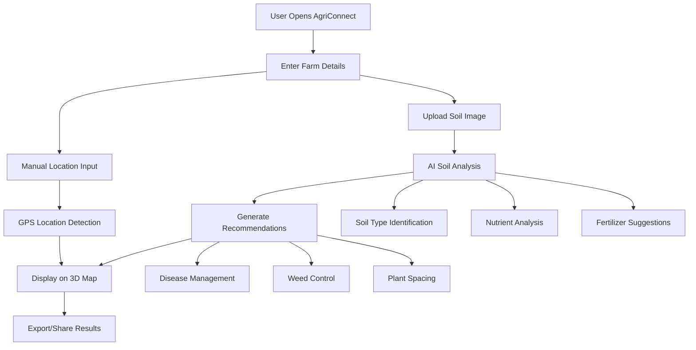

# 🌾 AgriConnect - Smart Crop Recommendations Platform

   

## 📋 Table of Contents

- [Overview](#overview)
- [Features](#features)
- [Technology Stack](#technology-stack)
- [Installation](#installation)
- [Configuration](#configuration)
- [Usage](#usage)
- [API Integration](#api-integration)
- [Workflow](#workflow)
- [Screenshots](#screenshots)
- [Future Roadmap](#future-roadmap)
- [Contributing](#contributing)


## 🌟 Overview

AgriConnect is an AI-powered agricultural platform that provides smart crop recommendations for farmers. The platform combines advanced AI algorithms with environmental data to offer personalized farming insights, soil analysis, and crop suggestions based on location, soil type, climate conditions, and seasonal patterns.

### Key Capabilities

- **Smart Analysis**: Data-driven insights for better farming decisions
- **Maximize Yield**: Optimize harvest with tailored recommendations
- **Climate Aware**: Recommendations based on local weather patterns
- **AI-Powered Soil Analysis**: Detailed nutrient analysis and fertilizer recommendations
- **Interactive 3D Maps**: Visual farm location mapping with rectangular overlays
- **Real-time Recommendations**: Dynamic crop suggestions based on farm parameters

## 🚀 Features

### 1. **Farm Details Input System**
- **Location Services**: GPS-based farm location detection
- **Manual Input**: Latitude and longitude coordinates
- **Farm Parameters**: Size, soil type, climate zone, season
- **Environmental Data**: Rainfall, temperature, irrigation availability

### 2. **AI-Powered Soil Analysis** 🔬
- **Image Upload**: Upload soil photos for analysis
- **Nutrient Analysis**: Detailed soil composition assessment
- **Fertilizer Recommendations**: Specific fertilizer suggestions
- **Soil Type Identification**: Automatic soil classification
- **Crop Suitability**: Recommendations based on soil analysis

### 3. **Interactive 3D Map Visualization** 🗺️
- **Google Maps 3D Integration**: High-resolution satellite imagery
- **Farm Boundary Marking**: Red rectangular overlays for farm areas
- **Corner Point Markers**: Precise farm boundary definition
- **Real-time Updates**: Dynamic map updates based on input parameters
- **Zoom and Pan**: Interactive map navigation

### 4. **Smart Crop Recommendations** 🌱
- **Disease Management**: Disease-resistant variety suggestions
- **Weed Competition**: Strategic weeding and mulching advice
- **Plant Spacing**: Optimal spacing recommendations
- **Seasonal Planning**: Time-based crop suggestions
- **Yield Optimization**: Data-driven yield improvement strategies

### 5. **News Integration** 📰
- **Farm-o-Buzz**: Agricultural news and updates
- **Real-time Information**: Latest farming trends and technologies
- **External Links**: Direct access to agricultural news sources

## 🛠️ Technology Stack

### Frontend
- **React 18+**: Modern UI framework
- **TypeScript**: Type-safe development
- **Vite**: Fast build tool and development server
- **CSS3**: Modern styling with responsive design
- **Google Maps 3D API**: Interactive map visualization

### AI & APIs
- **Google Gemini 2.5 Flash**: AI-powered soil analysis
- **Google Maps API**: 3D map integration
- **Geolocation API**: GPS-based location services

### Development Tools
- **ESLint**: Code linting and quality assurance
- **Prettier**: Code formatting
- **Git**: Version control

## 📦 Installation

### Prerequisites
- Node.js (v16 or higher)
- npm 
- Google Maps API key
- Google Gemini API key

### Setup Instructions

1. **Clone the repository**
   ```bash
   git clone https://github.com/your-username/agri-connect.git
   cd agri-connect
   ```

2. **Install dependencies**
   ```bash
   npm install
   ```

3. **Environment Configuration**
   Create a `.env` file in the root directory:
   ```env
   GEMINI_API_KEY=your_gemini_api_key_here
   MAPS_API_KEY=your_google_maps_api_key_here
   ```

4. **Start development server**
   ```bash
   npm run dev
   ```

5. **Open in browser**
   Navigate to `http://localhost:3000`

## ⚙️ Configuration

### Environment Variables

| Variable | Description | Required |
|----------|-------------|----------|
| `GEMINI_API_KEY` | Google Gemini API key for AI analysis | Yes |
| `MAPS_API_KEY` | Google Maps API key for map functionality | Yes |


## 📖 Usage

### 1. **Farm Setup**
1. Open the AgriConnect platform
2. Click "Use Current Location" or manually enter coordinates
3. Fill in farm details:
   - Soil type (Loamy, Clayey, Sandy, etc.)
   - Climate zone (Temperate, Tropical, etc.)
   - Season (Spring, Summer, Fall, Winter)
   - Farm size in hectares
   - Annual rainfall and temperature
   - Irrigation availability

### 2. **Soil Analysis**
1. Click the "🔬 Soil Analysis" button
2. Upload a clear photo of your soil sample
3. Click "Analyze Soil" to get AI-powered analysis
4. Review detailed nutrient analysis and fertilizer recommendations
5. Use insights for crop planning

### 3. **Map Visualization**
1. Enter farm coordinates to see your location on the 3D map
2. Red markers will show your farm boundaries
3. Use the map to verify farm area and location accuracy
4. Zoom and pan to explore surrounding areas

### 4. **Crop Recommendations**
1. After soil analysis, click "Get Crop Recommendations"
2. Review AI-generated suggestions based on:
   - Soil composition
   - Climate conditions
   - Seasonal factors
   - Disease resistance
   - Yield optimization

## 🔄 Workflow



## 📸 Screenshots

### Main Dashboard


### Soil Analysis Interface


### 3D Map with Farm Overlay


### Crop Recommendations


## 🔮 Future Roadmap

### Phase 1: Enhanced AI Features
- **Predictive Analytics**: Crop yield prediction models
- **Disease Detection**: Advanced plant disease identification
- **Pest Management**: AI-powered pest detection and control

### Phase 2: Advanced Mapping
- **NDVI Analysis**: Vegetation health mapping
- **Soil Moisture Mapping**: Real-time soil moisture visualization
- **Crop Rotation Planning**: Multi-season crop rotation suggestions


### Phase 3: Community Features
- **Farmer Network**: Connect with local farmers
- **Knowledge Sharing**: Community-driven farming tips
- **Market Integration**: Crop pricing and market trends
- **Expert Consultation**: Connect with agricultural experts

### Phase 4: Mobile Application
- **iOS App**: Native iOS application
- **Android App**: Native Android application
- **Offline Mode**: Work without internet connection
- **Push Notifications**: Real-time alerts and updates

## 🚀 Deployment

### Production Build
```bash
npm run build
# or
yarn build
```

### Deploy to Vercel
```bash
npm install -g vercel
vercel --prod
```

### Deploy to Netlify
```bash
npm install -g netlify-cli
netlify deploy --prod --dir=dist
```

## 🤝 Contributing

We welcome contributions! Please follow these steps:

1. Fork the repository
2. Create a feature branch (`git checkout -b feature/amazing-feature`)
3. Commit your changes (`git commit -m 'Add amazing feature'`)
4. Push to the branch (`git push origin feature/amazing-feature`)
5. Open a Pull Request

### Development Guidelines
- Follow TypeScript best practices
- Write comprehensive tests
- Update documentation
- Follow the existing code style
- Ensure all tests pass


## 🙏 Acknowledgments

- Google Maps API for mapping services
- Google Gemini AI for intelligent analysis
- React community for excellent documentation
- Open source contributors and maintainers

---

**Made with ❤️ for farmers worldwide**

*AgriConnect - Empowering farmers with AI-driven agricultural insights*